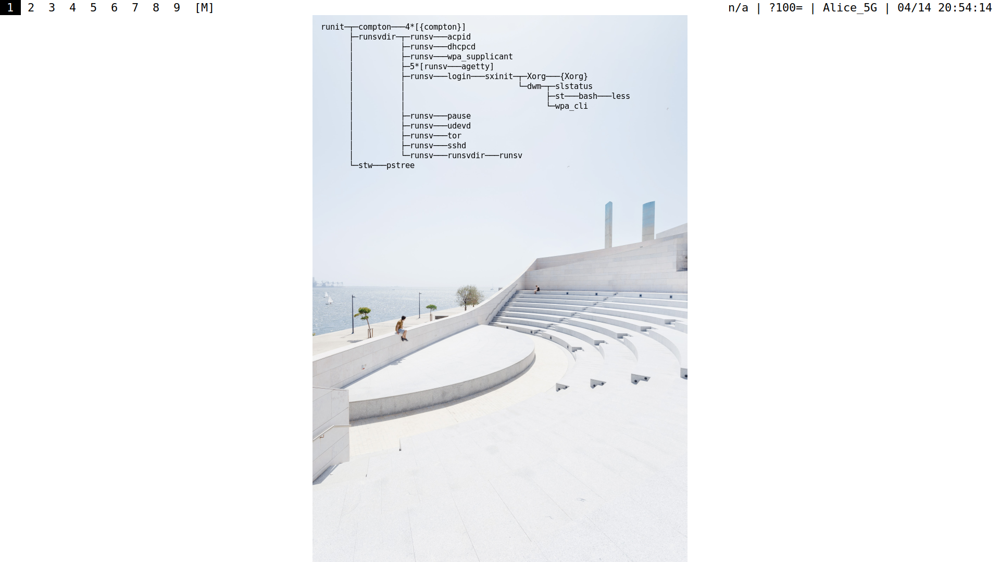

# stow

A C++ library for **click-through overlay windows** on X11, plus two small
binaries built on it.

The overlay is transparent, always-on-top, and passes clicks through to
whatever is underneath — so you can paint status text, gauges, or a box that
follows your cursor over a live desktop without getting in the way.



## The library

Three tiers. Each is usable on its own; you only pay for the one you take.

```
  stow::Hud       ini file -> full grid dashboard        (what shud runs)
     |
  stow::Grid      named cells, widgets, layout
     |
  stow::Overlay   one click-through window                <- the lightweight core
```

The public API is `include/stow/`. **No X11 header appears there** — a consumer
includes one header, links one target, and never sees `Display*`. (There is a
test that fails if that stops being true.)

### Tier 1: an overlay in six lines

```cpp
#include <stow/overlay.hpp>

int main() {
  stow::Overlay ov({.anchor = stow::Anchor::TopRight,
                    .font   = "monospace:size=12",
                    .alpha  = 0.8});
  ov.show();
  while (ov.pump())
    ov.set_text(read_status());
}
```

`pump()` services X events and presents a frame. Call it from your own loop —
stow never takes over your program. `pump(16ms)` blocks up to that long, which
is how you get a frame rate without a busy-spin.

### Immediate-mode drawing

For content that changes every frame, draw between `begin()` and `end()`:

```cpp
#include <stow/overlay.hpp>
#include <stow/screen.hpp>

stow::Overlay ov({.size = {120, 40}, .clickthrough = true});
ov.show();

while (ov.pump(std::chrono::milliseconds(16))) {   // ~60fps
  stow::Point p = stow::pointer();
  ov.move_to(p.x + 12, p.y + 12);                  // follow the cursor

  ov.begin();
  ov.rect({0, 0, 120, 40}, stow::Color::red(), 2); // 2px outline
  ov.text(6, 24, std::to_string(p.x) + "," + std::to_string(p.y));
  ov.end();
}
```

That is essentially `test/test_cursor.cpp` — build it and run
`./build/bin/test_cursor 10`.

> **XWayland caveat:** `stow::pointer()` uses `XQueryPointer`, which does not
> track the cursor under XWayland — the X server is only told about motion over
> surfaces it owns, so the position freezes until the cursor crosses an X
> window. Everything else (click-through, transparency, placement,
> multi-monitor, rendering) works normally there. If you need the pointer on a
> Wayland compositor, ask the compositor: `test_cursor.cpp` shows the pattern
> using `hyprctl cursorpos`, including the monitor-name mapping needed because
> Hyprland and X do not share a coordinate space.

### Capabilities degrade, they don't fail

A compositor may refuse click-through or an ARGB visual (WSLg, some XWayland
setups). The overlay still renders; ask what you actually got:

```cpp
stow::Caps c = ov.caps();   // .clickthrough .transparency .override_redirect
```

Only "no display at all" is a construction failure:

```cpp
stow::Error err;
if (auto ov = stow::Overlay::create(cfg, &err)) { /* ... */ }
else std::fprintf(stderr, "stow: %s\n", err.message.c_str());
```

### Tier 3: an ini-driven HUD

```cpp
#include <stow/hud.hpp>

stow::Error err;
if (auto hud = stow::Hud::from_file("hud.ini", &err)) hud->run();
```

```ini
[grid]
rows = 1
cols = 2
single_window = 1

[cell]
widget = number
cmd    = "echo 42"
label  = CPU

[cell]
widget = bar
cmd    = "echo 63"
label  = MEM
max    = 100
```

See `test/hud_test.ini` for a working example.

## Using it from your own project

```bash
cmake -S . -B build -DCMAKE_INSTALL_PREFIX=/usr/local
cmake --build build -j$(nproc)
sudo cmake --install build
```

```cmake
find_package(stow REQUIRED)
target_link_libraries(mytool PRIVATE stow::stow)
```

That is the whole integration. X11, Xft and freetype are linked for you and
stay out of your include path.

## Building and testing

```bash
cmake -S . -B build
cmake --build build -j$(nproc)
ctest --test-dir build
```

`ctest` runs only the **headless** tests by default — fast, and nothing appears
on your screen. The X11 tests map real windows over the live desktop, so they
are opt-in:

```bash
cmake -S . -B build -DSTOW_TEST_X11=ON
ctest --test-dir build            # everything
ctest --test-dir build -L x11     # just the windowed ones
```

Without `$DISPLAY` the X11 tests report *skipped* rather than failing, so a
headless run stays meaningful.

Dependencies: `freetype`, `X11`, `Xft`, `Xext`, `Xfixes` (plus `Xrandr` or
`Xinerama` for multi-monitor, both optional).

## The binaries

**`stow`** — runs a command on a timer and renders its output, like `watch` on
your wallpaper:

```bash
stow -F 'monospace:size=8' pstree -U
```

It creates an unmanaged X window at a chosen position, restarts the subcommand
every `period` seconds, buffers its output, and renders on a delimiter line or
process exit. Font, alignment, colors, opacity, position, border and period are
all settable on the command line. It hides itself when the output is empty.

**`shud`** — renders a grid dashboard from an ini file:

```bash
shud hud.ini
```

## Layout

```
include/stow/     PUBLIC API — no X11 anywhere in this tree
src/              private implementation; never installed
  x11/              window, monitors, pointer
  proc/             pty/pipe subprocesses, terminal emulation
  hud/              dashboard, widgets
  bin/              the stow and shud binaries
```

`stow` uses the private headers directly (it drives `PTYProcess`); `shud` is
built against the public API alone, which is the standing proof that the full
feature set is reachable without reaching inside.

## History

Forked from `stw`, a simple text window for X (see `doc/stow.1` and `LICENSE`
for the original attribution), and updated with a CMake build, X11
click-through for a true overlay,
ANSI color support via pseudo-terminal emulation, multi-monitor awareness, and
the library API described above.

## License

See `LICENSE`.
